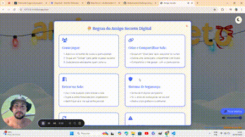

# 🎅 Amigo Secreto Digital

[](https://opensource.org/licenses/MIT)


Um sistema interativo para sorteio de Amigo Secreto com recursos modernos e interface amigável.



## ✨ Funcionalidades Principais

- 🎉 **Sorteio Automático**: Gere combinações secretas de forma justa e aleatória
- 🔒 **Salas Protegidas**: Crie salas privadas com senha e compartilhe via link único
- 🎵 **Ambiente Festivo**: Música tema e efeitos sonoros ajustáveis
- 🌓 **Modo Noturno**: Alternância entre temas claro e escuro
- 🛡️ **Proteção de Dados**: Senha pessoal de 4 dígitos para cada participante
- ❄️ **Efeitos Visuais**: Animação de neve e elementos festivos
- 📱 **Responsivo**: Funcional apenas para web desktop

## 🚀 Como Usar

### Criando uma Sala
1. Adicione os nomes dos participantes
2. Clique em "Criar Sala"
3. Defina uma senha para a sala
4. Compartilhe o link gerado com os participantes

### Participando de uma Sala
1. Acesse o link recebido
2. Insira a senha da sala
3. Identifique-se com seu nome
4. Crie/Cole sua senha pessoal
5. Revele seu amigo secreto!

## 🛠 Tecnologias Utilizadas

- **HTML5** & **CSS3**: Estrutura e estilo
- **JavaScript**: Lógica de sorteio e interações
- **Lottie**: Animações em SVG
- **LocalStorage**: Armazenamento local de dados
- **Font Awesome**: Ícones
- **Google Fonts**: Tipografia

## ⚙️ Instalação

```bash
# Clone o repositório
git clone https://github.com/devbernardes/challenge-amigo-secreto.git

# Acesse o diretório
cd challenge-amigo-secreto

# Abra o arquivo principal
open index.html
